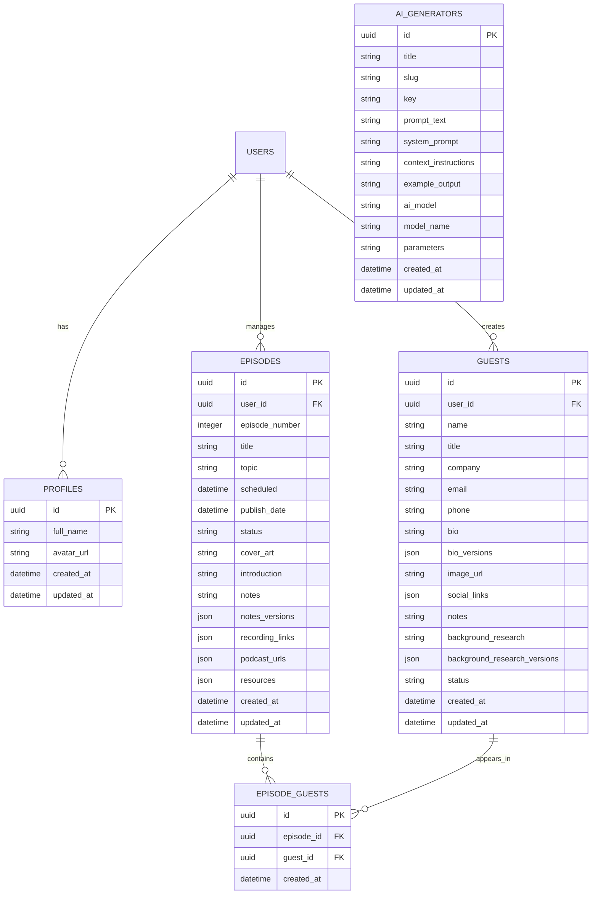

# Database Model

The Podcast Planner application uses a relational database structure in Supabase. Below is an Entity Relationship Diagram (ERD) representing the database model:

## Key Entities

### Users
Represents authenticated users of the application

### Profiles
Extended user information beyond authentication details

### Guests
Podcast guest information including contact details, biography, and research

### Episodes
Podcast episode details including scheduling, content, and publishing information

### Episode_Guests
Junction table representing the many-to-many relationship between episodes and guests

### AI_Generators
Configuration for AI content generation tools

## Content Versioning

The database employs JSON fields to store version history for content that can be generated with AI:
- `bio_versions` in guests table
- `background_research_versions` in guests table
- `notes_versions` in episodes table

Each version includes:
- Unique ID
- Content
- Timestamp
- Source attribution
- Version number

